# Advanced RAG - 混合精度检索实验平台

一个面向学习与实践的 **Advanced RAG** 项目，系统实现了 8 种检索策略、3 种分块方法、多级增强模块，以及基于 RAGAS 框架的全方位评估体系。通过对比实验，帮助你直观理解不同 RAG 改进措施的实际效果。

> 这是一个用于公开发布的精简版本：不包含原私有仓库的提交历史、本地环境配置、运行缓存、日志和未公开数据集。

## 目录

- [项目架构](#项目架构)
- [核心功能](#核心功能)
  - [文档处理 Pipeline](#1-文档处理-pipeline)
  - [8 种检索策略](#2-8-种检索策略)
  - [增强模块](#3-增强模块)
  - [评估体系](#4-评估体系)
- [技术栈](#技术栈)
- [快速开始](#快速开始)
- [使用方法](#使用方法)
- [评估数据集](#评估数据集)
  - [评估数据集格式规范](#评估数据集格式规范)
- [内部机制](#内部机制)
  - [Ingest 流程详解](#ingest-流程详解)
  - [增量入库与断点续传](#增量入库与断点续传)
  - [缓存体系与数据集隔离](#缓存体系与数据集隔离)
  - [双索引架构](#双索引架构)
  - [Evaluate 流程详解](#evaluate-流程详解)
  - [Generate-eval 流程详解](#generate-eval-流程详解)
    - [领域配置系统](#领域配置系统)
  - [LLM 调用日志](#llm-调用日志)
- [关键算法说明](#关键算法说明)

---

## 项目架构

```
advanced-rag/
├── config.py                    # 全局配置（API Key、ChromaDB 地址、超参数）
├── main.py                      # CLI 主入口（6 个子命令）
├── environment.yml              # Conda 环境定义
├── .env.example                 # 环境变量模板
│
├── src/                         # 核心模块
│   ├── document_loader.py       # 文档加载（TXT/PDF/Markdown）
│   ├── chunking.py              # 3 种分块策略（含表格感知 + 质量过滤）
│   ├── embeddings.py            # 智谱 Embedding-3 封装
│   ├── llm.py                   # LLM 封装（智谱/DeepSeek，含调用日志）
│   ├── vectorstore.py           # ChromaDB 向量库（远程 HTTP Client，分批写入）
│   ├── sparse_retriever.py      # BM25 稀疏检索（jieba 分词）
│   ├── bge_m3_retriever.py      # BGE-M3 多粒度检索 (Dense+Sparse+ColBERT)
│   ├── retriever.py             # 8 种策略的统一检索接口
│   ├── reranker.py              # LLM 重排序 + 上下文压缩
│   ├── query_engine.py          # 查询引擎（编排检索→重排→生成）
│   └── rag_pipeline.py          # Pipeline 组装器（入库 + 查询）
│
├── evaluation/                  # 评估框架
│   ├── datasets.py              # 评估数据集加载（兼容多种格式）
│   ├── metrics.py               # 自定义检索/生成指标
│   ├── ragas_eval.py            # RAGAS 官方 evaluate() 封装（支持 OpenAI/DeepSeek/智谱 Judge）
│   ├── compare.py               # 多策略对比 + 缓存续传 + 可视化
│   ├── generate.py              # RAGAS TestsetGenerator 封装（自动生成评估数据集）
│   ├── domains/                 # 领域配置（插件式，每个领域一个 .py 文件）
│   │   ├── __init__.py          # DomainConfig 定义 + 加载器
│   │   ├── default.py           # 通用默认配置
│   │   └── ipcc.py              # IPCC 气候报告专用（persona/prompt/过滤）
│   ├── samples_eval_dataset.json   # samples 评估集（50 题中英文，仓库内置）
│   └── multihop_eval_dataset.json  # multihop 评估集（30 题多跳推理，仓库内置）
│
├── documents/                   # 文档目录（仓库只含 samples 和 multihop）
│   ├── samples/                 # 内置示例文档（9 篇中英文技术文）
│   ├── multihop_rag/            # MultiHop-RAG 精选子集（30 篇英文新闻）
│   └── {自定义数据集}/           # 用户自行添加，通过 .gitignore 排除
│
├── .index_cache/                # 本地索引缓存（运行时生成，不入仓库）
│   ├── {dataset}_bm25.pkl       # BM25 索引
│   ├── {dataset}_bge_m3.pkl     # BGE-M3 三粒度向量
│   ├── {dataset}_chunks.pkl     # Chunk 缓存（增量入库断点续传用）
│   ├── {dataset}_knowledge_graph.json  # RAGAS 知识图谱缓存
│   └── ragas_cache/             # RAGAS 评估结果缓存（按策略+模型+题数）
│       └── {dataset}_{strategy}_{mode}_n{N}_{judge_model}.json
│
└── output/                      # 输出目录（运行时生成，不入仓库）
    ├── history/                 # 历史评估结果（自动按时间戳归档）
    │   └── eval_{dataset}_{timestamp}/
    ├── retrieval_cache/         # Phase 1 检索结果缓存（含 HyDE 文本）
    │   └── {dataset}_{strategy}_{mode}_n{N}.json
    └── logs/                    # LLM 调用日志（按任务分文件）
```

> **仓库包含的文件**：`src/`、`evaluation/*.py`、`documents/samples/`、`documents/multihop_rag/`、`evaluation/samples_eval_dataset.json`、`evaluation/multihop_eval_dataset.json`、配置文件。
> **运行时生成的目录**：`.index_cache/`、`output/`、自定义 `documents/` 子目录、自定义评估数据集。均通过 `.gitignore` 排除。

### 数据流总览

#### 全局模块架构

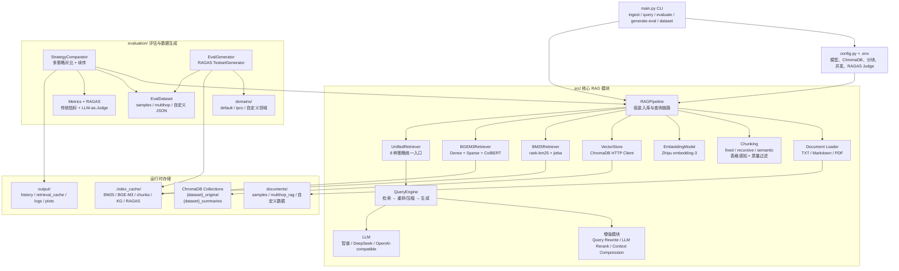

#### Ingest 入库主流程

```mermaid
flowchart LR
    Start(["python main.py ingest"])
    Docs["文档目录<br/>.txt / .md / .pdf"]
    Load["load_documents()<br/>读取文件并生成 Document"]
    Clean["preprocess()<br/>清理空白、规范换行"]
    Chunk{"分块策略"}
    Fixed["FixedChunking<br/>固定长度 + overlap"]
    Recursive["RecursiveChunking<br/>表格先抽取<br/>再按段落/句子递归切分"]
    Semantic["SemanticChunking<br/>句子 embedding 相似度断点"]
    Filter["is_low_quality_chunk()<br/>过滤过短、参考文献密集、低字母比例噪声"]

    CoreReady["7 种策略就绪<br/>naive_dense / sparse_bm25 / hybrid_rrf<br/>bge_m3_* / semantic_dual_path"]
    SummaryReady["8 种策略就绪<br/>multi_vector 可用"]

    subgraph Indexes["并行建立检索索引"]
        E3["Zhipu embedding-3<br/>chunk → 2048d vector"]
        Original["ChromaDB<br/>{dataset}_original"]
        BM25["BM25 index<br/>jieba 分词 + BM25Okapi"]
        BM25Cache[".index_cache/{dataset}_bm25.pkl"]
        BGE["BGE-M3 index<br/>Dense + Learned Sparse + ColBERT"]
        BGECache[".index_cache/{dataset}_bge_m3.pkl"]
        ChunkCache[".index_cache/{dataset}_chunks.pkl<br/>增量续传 + generate-eval 输入"]
    end

    subgraph OptionalSummary["最后执行，可 Ctrl+C 跳过或续传"]
        Summarize["LLM 批量摘要<br/>INGEST_LLM_MODEL"]
        SummaryEmb["摘要 embedding"]
        SummaryStore["ChromaDB<br/>{dataset}_summaries"]
    end

    Start --> Docs --> Load --> Clean --> Chunk
    Chunk --> Fixed --> Filter
    Chunk --> Recursive --> Filter
    Chunk --> Semantic --> Filter
    Filter --> E3 --> Original
    Filter --> BM25 --> BM25Cache
    Filter --> BGE --> BGECache
    Filter --> ChunkCache
    Original --> CoreReady
    BM25Cache --> CoreReady
    BGECache --> CoreReady
    CoreReady --> Summarize --> SummaryEmb --> SummaryStore --> SummaryReady
```

#### 查询与 8 种检索策略

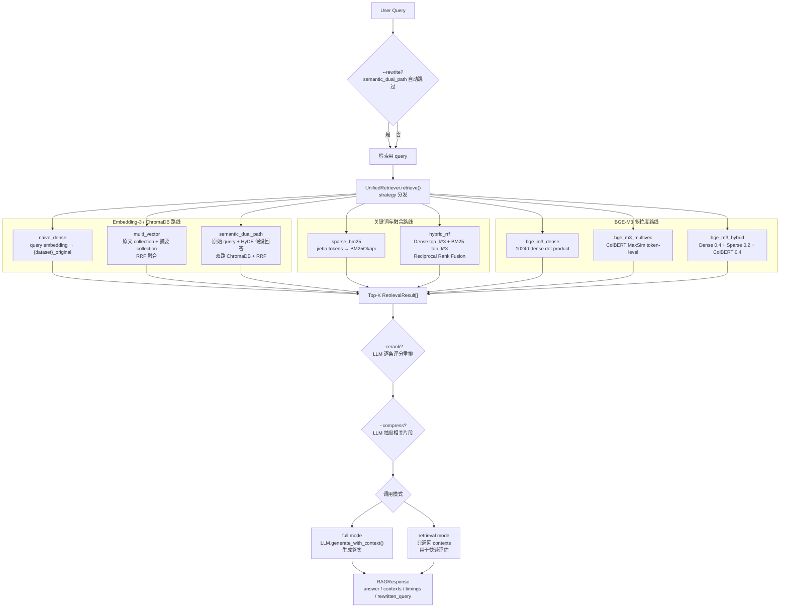

#### 评估与缓存流水线

```mermaid
flowchart LR
    EvalCmd(["python main.py evaluate"])
    EvalSet["评估集 JSON<br/>question / ground_truth / contexts / difficulty"]
    Strategies["策略列表<br/>all 或逗号分隔"]

    subgraph Phase1["Phase 1: Query Pipeline"]
        CacheCheck["检查 output/retrieval_cache"]
        RunQueries["逐策略 × 逐题运行<br/>pipeline.retrieve() 或 pipeline.query()"]
        RetCache["保存 Retrieval Cache<br/>冻结 contexts 与 HyDE 输出"]
    end

    subgraph Phase2["Phase 2: Metrics / Judge"]
        Mode{"--mode"}
        RetrievalMetrics["retrieval mode<br/>Hit Rate / MRR / P@K / R@K / NDCG"]
        FullMetrics["full mode<br/>ROUGE-L / BLEU"]
        RagasCacheCheck["检查 .index_cache/ragas_cache"]
        Ragas["RAGAS evaluate()<br/>Context Precision / Recall<br/>Faithfulness / Relevancy / Correctness"]
        RagasCache["保存 RAGAS Cache<br/>按 dataset + strategy + mode + judge_model"]
    end

    subgraph Reports["输出"]
        JSON["full_results.json<br/>meta + summary + details"]
        CSV["details.csv"]
        Table["comparison_table.txt"]
        Plots["--plot 图表<br/>retrieval 5 张 / full 6 张"]
    end

    EvalCmd --> EvalSet
    EvalCmd --> Strategies
    EvalSet --> CacheCheck
    Strategies --> CacheCheck
    CacheCheck -->|hit| RetCache
    CacheCheck -->|miss| RunQueries
    RunQueries --> RetCache
    RetCache --> Mode
    Mode -->|retrieval| RetrievalMetrics
    Mode -->|full| FullMetrics
    RetrievalMetrics --> RagasCacheCheck
    FullMetrics --> RagasCacheCheck
    RagasCacheCheck -->|hit| RagasCache
    RagasCacheCheck -->|miss| Ragas
    Ragas --> RagasCache
    RagasCache --> JSON
    RagasCache --> CSV
    RagasCache --> Table
    RagasCache --> Plots
```

---

## 核心功能

### 1. 文档处理 Pipeline

#### 文档加载

支持 3 种格式，通过文件扩展名自动识别：

| 格式 | 实现 | 说明 |
|------|------|------|
| `.txt` | 原生 Python | 直接读取文本 |
| `.md` | 原生 Python | 读取 Markdown 原文 |
| `.pdf` | PyPDF | 逐页提取文本并拼接 |

加载后统一进行预处理：清理多余空白、规范化换行符。

#### 3 种分块策略

| 策略 | 类名 | 原理 | 适用场景 |
|------|------|------|----------|
| **固定分块** | `FixedChunking` | 按字符数切分，相邻 chunk 有重叠区 | 简单、可预测，适合均匀分布的文本 |
| **递归分块** | `RecursiveChunking` | 按层级分隔符递归切分：段落(`\n\n`) → 句子(`。！？`) → 字符 | 尊重自然段落结构，通用性最好 |
| **语义分块** | `SemanticChunking` | 先按句子拆分，对每句生成 embedding，在相邻句子相似度低于阈值处断开 | 保持语义连贯，但需要额外 embedding 计算 |

分块参数可通过 `.env` 或 `config.py` 调整：
- `CHUNK_SIZE`: 1024（目标字符数，短文档可降至 512，长文档可升至 2048）
- `CHUNK_OVERLAP`: 128（重叠字符数，通常为 chunk_size 的 10-15%）
- `semantic_threshold`: 0.75（语义分块阈值，仅 `semantic` 策略使用）

#### 表格感知分块

递归分块策略内置了**表格感知**能力：在递归切分前，先识别文档中的完整 HTML 表格（`<table>...</table>`），连同前置标题行（如 `Table 10.1 | ...`）一起提取为独立 chunk，不参与后续切割。

```
原始文档 → 提取完整表格（独立 chunk，type="table"）
         → 剩余文本 → 递归分块（type="text"）
```

这避免了报告类文档（如 IPCC）中的数据表被切碎导致信息丢失。

#### Chunk 质量过滤

Ingest 阶段自动过滤低质量 chunk，减少噪声对检索的干扰：

| 规则 | 说明 | 适用类型 |
|------|------|---------|
| 过短 (<50 字符) | 碎片、标题残留 | text + table |
| 参考文献密集 (3+ `et al.` 或 2+ `doi:`) | 引用列表区域 | 仅 text |
| 字母比例低 (<35%) | 纯数字/符号/公式/图片引用 | 仅 text |

表格 chunk 只受"过短"规则约束，不会因含有作者引用而被误删。

> 以 IPCC WG2 Chapter 10 (Asia) 为例：673 raw chunks → 8 个完整表格保留 + 489 个文本保留，176 个低质量 chunk 过滤（26%）。

### 2. 8 种检索策略

这是项目的核心亮点。所有策略共享 `UnifiedRetriever` 接口，通过枚举值切换：

#### 策略 1: Naive Dense（纯向量检索）

```
Query ──[Embedding-3]──▶ Query Vector ──[Cosine Similarity]──▶ ChromaDB ──▶ Top-K
```

- **原理**: 将 query 编码为 2048 维向量，在 ChromaDB 中做余弦相似度检索
- **模型**: 智谱 `embedding-3`
- **优点**: 语义理解能力强，能匹配意思相近但措辞不同的文本
- **缺点**: 对精确关键词匹配不敏感（如专有名词、缩写）
- **定位**: 作为 baseline 对比

#### 策略 2: Sparse BM25（稀疏关键词检索）

```
Query ──[jieba 分词]──▶ Token List ──[BM25Okapi]──▶ Top-K
```

- **原理**: 经典的 TF-IDF 变体，基于词频和逆文档频率计算相关性
- **分词**: jieba 中文分词
- **算法**: BM25Okapi（参数 k1=1.5, b=0.75）
- **优点**: 对精确关键词匹配极其有效，速度快
- **缺点**: 无法理解语义同义词
- **定位**: 传统 IR baseline

#### 策略 3: Hybrid RRF（Dense + Sparse 融合）

```
Query ──┬──[Dense]──▶ Rank List 1 ──┐
        │                            ├──[RRF Fusion]──▶ Top-K
        └──[BM25]───▶ Rank List 2 ──┘
```

- **原理**: 分别用 Dense 和 BM25 各检索 `top_k * 3` 个候选，然后用 **Reciprocal Rank Fusion** 融合
- **RRF 公式**: $\text{score}(d) = \sum_{r} \frac{1}{k + \text{rank}_r(d)}$，k=60
- **优点**: 同时具备语义理解和精确匹配能力，是工业界最常用的混合检索方案
- **定位**: 推荐的默认策略

#### 策略 4-6: BGE-M3 三种模式（多粒度检索）

BGE-M3（智源研究院）是一个 **一模型三表示** 的多功能嵌入模型，一次编码同时输出 Dense、Sparse、ColBERT 三种向量：

```
                    ┌──▶ Dense Vector (1024d)       ──▶ 语义相似度检索
                    │
Text ──[BGE-M3]──▶  ├──▶ Sparse Weights {token:w}  ──▶ 学习型关键词检索
                    │
                    └──▶ Token Vectors [t1,...,tn]   ──▶ ColBERT MaxSim 检索
```

| 策略 | 模式 | 原理 | 特点 |
|------|------|------|------|
| `bge_m3_dense` | 稠密向量 | 1024 维向量余弦相似度 | 与 Naive Dense 类似，但使用 BGE-M3 模型 |
| `bge_m3_multivec` | **ColBERT 多向量** | Token-level MaxSim: $\text{score} = \sum_i \max_j \text{sim}(q_i, d_j)$ | 最精确的检索，捕捉 token 级别交互 |
| `bge_m3_hybrid` | **三路融合** | Dense(0.4) + Sparse(0.2) + ColBERT(0.4) 加权融合 | 综合最优，兼具语义理解 + 关键词匹配 + 细粒度交互 |

BGE-M3 的 **Learned Sparse** 与传统 BM25 的区别：
- BM25 的权重靠统计计算（TF-IDF），BGE-M3 的 Sparse 权重由模型学习得到
- BGE-M3 能学到同义词的关联（如"汽车"和"轿车"都会给予高权重），BM25 做不到
- BGE-M3 支持 100+ 种语言，中英文效果均优秀

#### 策略 7: Multi-Vector（原文+摘要双路召回）

```
                      ┌──[原文 Embedding]──▶ ChromaDB (original) ──▶ Rank 1 ──┐
Query ──[Embedding]──▶│                                                        ├──[RRF]──▶ Top-K
                      └──[摘要 Embedding]──▶ ChromaDB (summary)  ──▶ Rank 2 ──┘
```

- **原理**: 对每个 chunk 生成两种 embedding 表示：原文向量 + LLM 生成的摘要向量，分别检索后 RRF 融合
- **入库时**: 用 GLM-4 为每个 chunk 生成一句话摘要，摘要和原文分别存入两个 ChromaDB collection
- **检索时**: 同一个 query 向量在两个 collection 中分别检索，RRF 融合结果
- **优点**: 摘要路径能捕捉 chunk 的高层语义，原文路径保留细节
- **定位**: 展示多表示检索思路

#### 策略 8: Semantic Dual-Path（HyDE 语义双路）

```
                         ┌──[Original Embedding]──▶ Retrieve ──▶ Rank 1 ──┐
Query ──┬─[Embedding]───▶│                                                 ├──[RRF]──▶ Top-K
        │                └─────────────────────────────────────────────────┘
        └─[GLM-4 生成假设回答]──▶ [HyDE Embedding]──▶ Retrieve ──▶ Rank 2 ──┘
```

- **原理**: HyDE（Hypothetical Document Embeddings）— 先让 LLM 对 query 生成一个假设性回答，再用这个回答的 embedding 去检索
- **双路**: 路径 1 用原始 query embedding，路径 2 用 HyDE embedding，RRF 融合
- **直觉**: 假设性回答的 embedding 往往比短 query 更接近真实文档的 embedding 空间
- **优点**: 对复杂/模糊 query 效果显著提升
- **缺点**: 需要额外一次 LLM 调用，增加延迟
- **定位**: 展示 Query 增强的高级技巧

### 3. 增强模块

除了 8 种检索策略，还提供 3 个可插拔的增强模块，可与任意策略组合：

#### Query Rewriting（查询改写）

使用 GLM-4 对用户原始 query 进行扩展改写，补充上下文信息，使其更适合检索。

```python
# 示例
原始: "BM25 参数"
改写: "BM25 算法的核心参数 k1 和 b 的含义、作用及推荐取值范围"
```

注意：当使用 Semantic Dual-Path 策略时自动跳过 Query Rewrite，因为该策略内置了 HyDE 作为 query 增强。

#### LLM Reranker（重排序）

用 GLM-4 对检索到的候选文档逐一评分（0-1），然后按分数重排，取 top-k（默认 3）。

```
检索 top_k=5 ──▶ LLM 逐一打分 ──▶ 按分数排序 ──▶ 取 rerank_top_k=3
```

相比 Cross-encoder 重排序，LLM-based reranker 不需要额外模型，但延迟较高。

#### Context Compression（上下文压缩）

用 LLM 从每个 chunk 中提取与 query 最相关的关键信息片段，减少送入生成模型的 token 量。

```
原始 chunk (512 字) ──[LLM 提取]──▶ 压缩后关键信息 (~100 字)
```

### 4. 评估体系

项目实现了两层评估：传统指标 + RAGAS 进阶评估。

#### 传统指标（自实现）

**检索质量指标**:

| 指标 | 说明 |
|------|------|
| Hit Rate | 命中率：检索结果中包含相关文档的查询比例 |
| MRR | Mean Reciprocal Rank：第一个相关文档排名的倒数的均值 |
| Precision@K | Top-K 中相关文档的比例 |
| Recall@K | 被检索到的相关文档占全部相关文档的比例 |
| NDCG@K | 归一化折损累积增益，考虑排名位置的加权指标 |

**生成质量指标**:

| 指标 | 说明 |
|------|------|
| ROUGE-L | 基于最长公共子序列的 F1，衡量答案与参考的重叠度 |
| BLEU | 基于 n-gram 精度的得分，衡量生成质量 |

#### RAGAS 进阶评估（LLM-as-Judge）

使用 **RAGAS 官方 `evaluate()` 函数**（ragas 0.4.3），确保评估逻辑与 RAGAS 框架完全一致。支持通过 `.env` 切换 Judge 模型（OpenAI / DeepSeek / 智谱），推荐使用 OpenAI。

| 指标 | 评估什么 | 官方实现 |
|------|----------|----------|
| **Faithfulness** | 答案是否忠实于上下文 | 提取 claims → 逐条验证（多步 LLM） |
| **Answer Relevancy** | 答案与问题的相关性 | 反向生成 N 个问题 + embedding 相似度 + 惩罚项 |
| **Context Precision** | 相关上下文排名质量 | 逐 context 判断 useful/not useful |
| **Context Recall** | 关键信息覆盖率 | 从 ground truth 提取 sentences → 逐句验证 |
| **Answer Correctness** | 答案事实一致性 | TP/FP/FN 分类 + F1 score |
| **Hallucination Rate** | 幻觉率 | = 1 - Faithfulness |

**Judge 模型配置**（`.env`）：

```dotenv
# 推荐：OpenAI（完整支持 n 参数，Answer Relevancy 精度最高 + 避免同源偏差）
RAGAS_JUDGE_PROVIDER=openai
RAGAS_JUDGE_MODEL=gpt-4o-mini
OPENAI_API_KEY=your_openai_api_key_here

# 替代：DeepSeek（便宜，但 n 参数不完整，Answer Relevancy 降级为 1 个反向问题）
RAGAS_JUDGE_PROVIDER=deepseek
RAGAS_JUDGE_MODEL=deepseek-chat

# 替代：智谱（可能有同源偏差）
RAGAS_JUDGE_PROVIDER=zhipu
RAGAS_JUDGE_MODEL=glm-4
```

> **为什么推荐 OpenAI？** RAGAS 的 Answer Relevancy 指标请求 LLM 一次返回 `n=3` 个反向问题（多路生成），只有 OpenAI API 完整支持 `n` 参数。DeepSeek/智谱会降级为 1 个反向问题，导致该指标精度下降。

> **同源偏差**：如果生成摘要（ingest）和评估 judge 使用同族模型，judge 会偏向认同自己生成的内容，导致 multi_vector / HyDE 等策略的 RAGAS 分数偏高。使用不同厂商的模型做 judge 可以消除这种偏差。

#### 对比可视化

`evaluate --plot` 生成 6 张图表：

1. **RAGAS 雷达图** — 各策略在 5 个 RAGAS 维度的表现
2. **质量指标柱状图** — ROUGE-L / BLEU / Faithfulness / Correctness
3. **延迟堆叠柱状图** — 检索/生成耗时分解
4. **Faithfulness 热力图** — 逐题 × 策略的忠实度矩阵
5. **难度分组柱状图** — simple / inference / cross_document 分组得分
6. **策略排名条形图** — 综合得分排名

---

## 技术栈

| 组件 | 技术选型 | 说明 |
|------|----------|------|
| **语言模型（推理）** | 智谱 GLM-4 系列 | 查询改写、HyDE 生成、答案生成、重排序评分 |
| **语言模型（摘要）** | 智谱 `glm-4-flash` | Ingest 阶段摘要生成（独立配置，推荐用快模型） |
| **RAGAS Judge** | OpenAI / DeepSeek / 智谱 | RAGAS 评估的 LLM-as-Judge（推荐 OpenAI，完整支持 `n` 参数） |
| **Embedding** | 智谱 `embedding-3` | 2048 维向量，支持中文，批量调用（每批 64 条） |
| **向量数据库** | ChromaDB (HTTP Client) | 远程部署，cosine 距离，支持多 collection |
| **稀疏检索** | rank-bm25 + jieba | BM25Okapi 算法，jieba 中文分词 |
| **多粒度检索** | BGE-M3 (BAAI) | 一模型三表示：Dense + Learned Sparse + ColBERT，FlagEmbedding 库 |
| **评估框架** | RAGAS 0.4.3 官方 evaluate() | 支持 OpenAI / DeepSeek / 智谱做 LLM-as-Judge |
| **评估数据生成** | RAGAS TestsetGenerator | 知识图谱 + SingleHop/MultiHop synthesizer |
| **CLI** | argparse + rich | 彩色终端输出、表格、进度条 |
| **可视化** | matplotlib + pandas | 雷达图、柱状图对比 |
| **文档处理** | PyPDF | PDF 文本提取 |

### Python 环境

- Python 3.11（通过 Conda 管理）
- 环境名: `advanced-rag`

---

## 快速开始

### 1. 配置环境变量

```bash
cd /path/to/advanced-rag
cp .env.example .env
```

编辑 `.env` 文件：

```dotenv
# 必填
ZHIPUAI_API_KEY=your_zhipu_api_key_here    # 智谱 API Key
CHROMA_HOST=your_chroma_server_host         # ChromaDB 服务器地址
CHROMA_PORT=8000                            # ChromaDB 端口

# 模型配置
LLM_MODEL=glm-4.7-flashx                   # 问答、评估、重排等（推理模型）
INGEST_LLM_MODEL=glm-4-flash               # Ingest 摘要生成（推荐用快模型）
GENERATE_EVAL_LLM_MODEL=glm-4-flash        # 评估数据集生成（批量任务，推荐快模型）
EMBEDDING_MODEL=embedding-3                 # Embedding 模型
# 并发控制（按阶段分别设置，不同模型 QPS 不同）
MAX_CONCURRENT=5                            # 通用默认值（兜底）
MAX_CONCURRENT_GENERATE=5                   # generate-eval KG 构建（智谱 ~5-10 QPS）
MAX_CONCURRENT_JUDGE=20                     # RAGAS Judge 评估（OpenAI ~100+ QPS）

# RAGAS Judge（推荐 OpenAI，完整支持 n 参数 + 避免同源偏差）
RAGAS_JUDGE_PROVIDER=openai                 # openai / deepseek / zhipu
RAGAS_JUDGE_MODEL=gpt-4o-mini              # gpt-4o-mini / deepseek-chat / glm-4 等

# OpenAI API（RAGAS_JUDGE_PROVIDER=openai 时需要）
OPENAI_API_KEY=your_openai_key
OPENAI_BASE_URL=https://api.openai.com/v1

# DeepSeek API（RAGAS_JUDGE_PROVIDER=deepseek 时需要）
DEEPSEEK_API_KEY=your_deepseek_key
DEEPSEEK_BASE_URL=https://api.deepseek.com

# 分块参数
CHUNK_SIZE=1024                             # 分块大小（字符数，默认 1024）
CHUNK_OVERLAP=128                           # 分块重叠（字符数，默认 128）
```

| 参数 | 说明 | 默认值 | 建议 |
|------|------|--------|------|
| `LLM_MODEL` | 推理模型（问答/评估/重排） | `glm-4v-flash` | 按需选择，重模型质量高但慢 |
| `INGEST_LLM_MODEL` | 摘要生成模型（ingest 阶段） | `glm-4-flash` | 用快模型，摘要不需要深度推理 |
| `GENERATE_EVAL_LLM_MODEL` | 评估数据集生成模型 | `glm-4-flash` | 批量任务，推荐快模型 |
| `MAX_CONCURRENT` | 通用并发默认值 | `5` | 兜底值，未设分阶段变量时使用 |
| `MAX_CONCURRENT_GENERATE` | generate-eval KG 构建并发 | `MAX_CONCURRENT` | 智谱 ~5-10 |
| `MAX_CONCURRENT_JUDGE` | RAGAS Judge 评估并发 | `MAX_CONCURRENT` | OpenAI 可设 20+ |
| `RAGAS_JUDGE_PROVIDER` | RAGAS Judge 的 LLM 厂商 | `zhipu` | `openai` 推荐（完整支持 `n` 参数 + 避免同源偏差） |
| `RAGAS_JUDGE_MODEL` | RAGAS Judge 模型名 | 跟随 `LLM_MODEL` | `gpt-4o-mini` / `deepseek-chat` / `glm-4` |
| `OPENAI_API_KEY` | OpenAI API Key | — | Judge 用 OpenAI 时必填 |
| `DEEPSEEK_API_KEY` | DeepSeek API Key | — | Judge 用 DeepSeek 时必填 |
| `CHUNK_SIZE` | 分块目标字符数 | `1024` | 短文档 512，长文档 1024-2048 |
| `CHUNK_OVERLAP` | 相邻 chunk 重叠字符数 | `128` | 通常为 chunk_size 的 10-15% |

### 2. 激活 Conda 环境

```bash
conda activate advanced-rag
```

### 3. 文档入库

项目内置两个预设数据集，通过 `-d` 参数切换：

```bash
# 内置中英文技术文档（默认）
python main.py ingest -d samples --reset

# MultiHop-RAG 精选子集（30 篇英文新闻，多跳推理）
python main.py ingest -d multihop --reset
```

入库流程（详见 [Ingest 流程详解](#ingest-流程详解)）：
1. 加载 → 预处理 → 表格感知递归分块 + 质量过滤
2. 智谱 Embedding-3 向量 → ChromaDB (`{dataset}_original`)
3. BM25 索引 → `.index_cache/{dataset}_bm25.pkl`
4. BGE-M3 多粒度向量 → `.index_cache/{dataset}_bge_m3.pkl`
5. **✅ 7 种策略就绪**（可立即跑 generate-eval / evaluate）
6. LLM 摘要 → ChromaDB (`{dataset}_summaries`)（慢，放最后，可 Ctrl+C 跳过）
7. Chunk 缓存 → `.index_cache/{dataset}_chunks.pkl`（增量模式）

### 4. 查询测试

```bash
python main.py query "什么是混合检索" -d samples --strategy hybrid_rrf
python main.py query "Which company was involved in antitrust actions?" -d multihop --strategy bge_m3_hybrid
```

---

## 使用方法

### 命令一览

```bash
python main.py <command> [options]
```

| 命令 | 说明 |
|------|------|
| `ingest` | 文档入库（加载→分块→编码→索引） |
| `query` | 单次查询 |
| `evaluate` | 运行评估对比（加 `--plot` 生成图表） |
| `interactive` | 交互式查询模式 |
| `generate-eval` | 从已入库 chunks 自动生成评估数据集（基于 RAGAS） |
| `dataset list` | 查看所有已入库的数据集 |
| `dataset delete <名称>` | 删除指定数据集（ChromaDB collection + 本地缓存） |

**所有命令都支持 `-d <数据集名>` 参数**（默认 `samples`），不同数据集的向量库和索引完全隔离。

### ingest — 文档入库

```bash
# 内置 samples 数据集（9 篇中英文技术文档）
python main.py ingest -d samples --reset

# MultiHop-RAG 数据集（30 篇英文新闻，多跳推理）
python main.py ingest -d multihop --reset

# 自定义数据集
python main.py ingest -d my_project --doc-dir /path/to/my/docs --reset

# 大数据集推荐：逐文件增量入库（支持断点续传）
python main.py ingest -d wg2 --doc-dir documents/wg2 --reset --incremental

# 中断后续传（不加 --reset，自动跳过已入库的文件）
python main.py ingest -d wg2 --doc-dir documents/wg2 --incremental

# 跳过摘要（快速入库，7 策略可用，以后可补）
python main.py ingest -d wg2 --doc-dir documents/wg2 --reset --incremental --no-summary

# 指定分块策略
python main.py ingest -d samples --chunking semantic
```

| 参数 | 说明 | 默认值 |
|------|------|--------|
| `-d, --dataset` | 数据集名称 | `samples` |
| `--doc-dir` | 文档目录路径（不指定则用预设） | 数据集预设目录 |
| `--chunking` | 分块策略: `fixed` / `recursive` / `semantic` | `recursive` |
| `--reset` | 清空该数据集的向量库后重新入库 | `false` |
| `--incremental` | 逐文件增量入库（大数据集推荐，支持断点续传） | `false` |
| `--no-summary` | 跳过摘要生成（multi_vector 降级为纯 dense，其他 7 策略不受影响） | `false` |

#### 增量入库模式（`--incremental`）

适用于大量文档（如 IPCC 全量 18 章、8.6MB）。与默认模式的区别：

| | 默认模式 | 增量模式 (`--incremental`) |
|---|---------|-------------------------|
| 处理方式 | 一次性加载全部文件 | 逐文件处理，每个文件独立完成全部步骤 |
| 中断恢复 | 全部重来 | 从本地 chunk 缓存续传（详见 [增量入库与断点续传](#增量入库与断点续传)） |
| BM25/BGE-M3 | 随文档一起构建 | 全部文件入完后从 chunks.pkl 统一重建 |
| 适用场景 | 小数据集（<100 文件） | 大数据集、长时间运行 |

**断点续传**：中断后重新运行（不加 `--reset`），自动从 `.index_cache/{dataset}_chunks.pkl` 读取已处理的 chunk ID，跳过已入库的文件。

### query — 单次查询

```bash
# samples 数据集查询
python main.py query "RAG 的三个阶段是什么" -d samples
python main.py query "BM25 的参数含义" -d samples --strategy sparse_bm25

# multihop 数据集查询
python main.py query "Which company was involved in antitrust actions?" -d multihop --strategy bge_m3_hybrid

# 启用增强模块
python main.py query "向量检索" -d samples --strategy naive_dense --rerank --rewrite
```

**可用策略**:
`naive_dense` | `sparse_bm25` | `hybrid_rrf` | `bge_m3_dense` | `bge_m3_multivec` | `bge_m3_hybrid` | `multi_vector` | `semantic_dual_path`

| 参数 | 说明 | 默认值 |
|------|------|--------|
| `question` | 查询问题（必填） | - |
| `-d, --dataset` | 数据集名称 | `samples` |
| `--strategy` | 检索策略 | `hybrid_rrf` |
| `--rerank` | 启用 LLM 重排序 | `false` |
| `--rewrite` | 启用 Query 改写 | `false` |
| `--compress` | 启用上下文压缩 | `false` |

### evaluate — 运行评估对比

项目支持两种评估模式：

| 模式 | 命令 | 速度 | 评估内容 | 适用场景 |
|------|------|------|----------|----------|
| **retrieval** | `--mode retrieval` | 分钟级 | 传统检索指标 + RAGAS Context Precision/Recall | 策略快速对比、超参数调优 |
| **full** | `--mode full`（默认） | 小时级 | 生成指标 + RAGAS 5 指标（Faithfulness 等） | 最终报告、端到端质量评估 |

> **推荐流程**：先用 `--mode retrieval` 快速筛选出最优检索策略，再对 top 策略跑 `--mode full`。

```bash
# ★ 纯检索评估（传统指标 + RAGAS 检索指标，比 full 模式快 5-10x）
python main.py evaluate -d wg2 --strategies naive_dense,hybrid_rrf,bge_m3_hybrid,multi_vector --mode retrieval

# 完整评估（检索 + 生成 + RAGAS）
python main.py evaluate -d samples --strategies naive_dense,hybrid_rrf,bge_m3_hybrid --n-questions 5

# 评估 + 生成 6 张可视化图表
python main.py evaluate -d multihop --strategies naive_dense,hybrid_rrf,bge_m3_hybrid --n-questions 5 --plot

# 自定义数据集（评估文件按约定命名后无需 --eval-file）
python main.py evaluate -d my_dataset --strategies hybrid_rrf,bge_m3_hybrid --mode retrieval

# 显式指定评估文件路径
python main.py evaluate -d my_dataset --eval-file /path/to/my_eval.json --plot

# 跳过 RAGAS（只看传统指标，速度快很多）
python main.py evaluate -d samples --no-ragas
```

| 参数 | 说明 | 默认值 |
|------|------|--------|
| `-d, --dataset` | 数据集名称（自动匹配评估文件） | `samples` |
| `--mode` | 评估模式: `retrieval`（纯检索）/ `full`（完整） | `full` |
| `--eval-file` | 显式指定评估文件路径（覆盖自动匹配） | 自动匹配 |
| `--strategies` | 逗号分隔的策略列表，或 `all` | `all` |
| `--n-questions` | 评估问题数量 | 全部 |
| `--no-ragas` | 跳过 RAGAS 评估（仅 full 模式有效） | `false` |
| `--no-cache` | 忽略 RAGAS 和检索结果缓存，强制重新评估 | `false` |
| `--plot` | 生成可视化对比图表 | `false` |

**评估文件自动匹配规则**（优先级从高到低）：

1. `--eval-file` 显式指定的路径
2. `evaluation/{dataset}_eval_dataset.json`（约定命名，`generate-eval` 输出位置）
3. 预设数据集配置（`samples` → `samples_eval_dataset.json`，`multihop` → `multihop_eval_dataset.json`）
4. 默认 `evaluation/samples_eval_dataset.json`

每次评估自动保存到 `output/history/eval_{dataset}_{时间戳}/` 目录：

**Full 模式输出** (6 张图)：
```
output/history/eval_{dataset}_{timestamp}/
├── full_results.json            # 完整数据（含逐题：问题、答案、上下文、RAGAS 明细）
├── details.csv                  # 扁平化 CSV，方便 pandas 分析
├── comparison_table.txt         # 对齐的纯文本对比表格（最优值标 *）
├── 01_ragas_radar.png           # RAGAS 5 维雷达图
├── 02_quality_metrics.png       # 质量指标柱状图
├── 03_latency.png               # 延迟堆叠柱状图
├── 04_faithfulness_heatmap.png  # 逐题×策略 Faithfulness 热力图
├── 05_difficulty_breakdown.png  # 按难度分组得分对比
└── 06_strategy_ranking.png      # 综合得分排名
```

**Retrieval 模式输出** (5 张图)：
```
output/history/eval_{dataset}_{timestamp}/
├── full_results.json            # 完整数据（含检索指标 + RAGAS 检索指标）
├── details.csv
├── comparison_table.txt         # 对齐的纯文本对比表格
├── 01_retrieval_metrics.png     # 检索质量指标 (Hit Rate/MRR/P@K/R@K/NDCG + Context Precision/Recall)
├── 02_retrieval_latency.png     # 检索延迟对比
├── 03_context_heatmap.png       # 逐题×策略 Context Quality 热力图
├── 04_difficulty_breakdown.png  # 按难度分组 Hit Rate 对比
└── 05_strategy_ranking.png      # 综合检索得分排名
```

### interactive — 交互式查询

```bash
python main.py interactive -d samples --strategy hybrid_rrf
python main.py interactive -d multihop --strategy bge_m3_hybrid
```

在交互模式中：
- 输入问题即可查询
- `/strategy <name>` 切换检索策略
- `quit` 或 `Ctrl+C` 退出

### generate-eval — 自动生成评估数据集

基于 [RAGAS TestsetGenerator](https://docs.ragas.io/en/stable/concepts/test_data_generation/)，从已入库的 chunks 自动生成评估数据集。支持**领域配置**：通过 `--domain` 加载领域专用的 persona、prompt 引导和质量过滤规则。

```bash
# 通用生成（默认领域，40/30/30 分布）
python main.py generate-eval -d samples --n-questions 50

# IPCC 领域（专用 persona + 引导 prompt + 质量过滤，20/40/40 分布）
python main.py generate-eval -d wg2 --domain ipcc --n-questions 50

# 指定模型（学术文本推荐 deepseek-chat 或 glm-4，避免 flash 级模型的幻觉）
python main.py generate-eval -d wg2 --domain ipcc --n-questions 50 --model deepseek-chat

# 生成后直接评估
python main.py generate-eval -d wg2 --domain ipcc -n 50 && \
python main.py evaluate -d wg2 --mode retrieval --strategies naive_dense,hybrid_rrf,bge_m3_hybrid --plot
```

| 参数 | 说明 | 默认值 |
|------|------|--------|
| `-d, --dataset` | 数据集名称（需已完成 ingest） | `samples` |
| `-n, --n-questions` | 生成问题数量 | `50` |
| `--domain` | 领域配置名（加载 `evaluation/domains/{name}.py`） | `default` |
| `--model` | LLM 模型覆盖 | `GENERATE_EVAL_LLM_MODEL` |
| `--max-chunks` | 采样 chunk 上限 | `300` |
| `--max-workers` | LLM 并发数 | `5`（cap 到 `MAX_CONCURRENT_GENERATE`） |
| `--seed` | 随机种子（可复现） | `42` |
| `--output` | 输出路径 | `evaluation/{dataset}_eval_dataset.json` |

**前置条件**：必须先完成 ingest（需要 `.index_cache/{dataset}_chunks.pkl`）。增量模式 (`--incremental`) 会自动保存 chunk 缓存。

#### 领域配置

领域配置文件位于 `evaluation/domains/`，每个 `.py` 文件定义一个 `DOMAIN_CONFIG` 实例：

```
evaluation/domains/
├── __init__.py    # DomainConfig 定义 + load_domain_config() 加载器
├── default.py     # 通用默认（无 --domain 时使用）
└── ipcc.py        # IPCC 气候报告专用
```

每个 `DomainConfig` 包含：

| 字段 | 说明 | IPCC 示例 |
|------|------|----------|
| `distribution` | 题目难度分布 (simple, inference, cross_doc) | `(0.2, 0.4, 0.4)` |
| `personas` | 虚拟用户角色列表 | 政策分析师 / 适应工程师 / 脆弱性研究员 |
| `llm_context` | 生成引导 prompt | 引导生成定量/对比/因果/不确定性感知题目 |
| `chunk_filter` | 额外的 chunk 过滤函数 | 过滤目录页/作者列表/图片引用/附录 |
| `post_filter` | 生成后质量过滤函数 | 过滤作者/引用/结构类问题 + 幻觉检测 |

**新增领域**：创建 `evaluation/domains/my_domain.py`，定义 `DOMAIN_CONFIG = DomainConfig(...)`，然后 `--domain my_domain` 即可使用。

#### 内置 IPCC 领域配置

IPCC 配置针对学术报告做了以下优化：

| 优化 | 默认 | IPCC |
|------|------|------|
| 难度分布 | 40% simple | **20% simple, 40% inference, 40% cross_doc** |
| Persona | 自动生成 | **3 个专业角色**（政策/工程/研究） |
| Chunk 过滤 | 通用规则 | **+目录页/作者列表/图片/附录/引用格式** |
| Post 过滤 | 无 | **过滤作者/引用/结构类问题 + 幻觉检测** |
| 生成引导 | 无 | **定量/对比/因果/不确定性/跨部门** |
| 过量生成 | 无 | **多生成 30% 补偿 post_filter 损耗** |

### dataset — 数据集管理

```bash
# 查看所有已入库的数据集（含 chunk 数量、缓存状态）
python main.py dataset list

# 删除指定数据集（清除 ChromaDB + BM25/BGE-M3/Chunk 缓存）
python main.py dataset delete multihop
```

删除操作会清理以下所有资源：
- ChromaDB collections: `{dataset}_original`, `{dataset}_summaries`
- 本地缓存: `.index_cache/{dataset}_bm25.pkl`, `_bge_m3.pkl`, `_chunks.pkl`, `_knowledge_graph.json`

---

## 评估数据集

项目内置两个评估数据集，通过 `-d` 参数切换：

### 数据集 1: samples（默认）

9 篇中英文技术文档 + 50 道 QA 题，适合**入门学习和快速验证**。

| 文档 | 语言 | 大小 | 主题 | 题目数 |
|------|------|------|------|--------|
| `01_rag_basics.txt` | 中文 | ~1.8 KB | RAG 基础概念 | 5 |
| `02_vector_retrieval.txt` | 中文 | ~2.1 KB | 向量检索技术 | 5 |
| `03_hybrid_retrieval.txt` | 中文 | ~2.2 KB | 混合检索方法 | 5 |
| `04_advanced_rag.txt` | 中文 | ~2.4 KB | Advanced RAG 技术 | 5 |
| `05_llm_fundamentals.txt` | 中文 | ~2.7 KB | 大语言模型基础 | 3 |
| `06_attention_and_transformers_en.txt` | English | ~9.3 KB | Attention & Transformer 深度解析 | 7 |
| `07_vector_databases_en.txt` | English | ~10.6 KB | 向量数据库与 ANN 算法 | 6 |
| `08_prompt_engineering_en.txt` | English | ~10.4 KB | Prompt Engineering 与 ICL | 6 |
| `09_rag_engineering_cn.txt` | 中文 | ~10.1 KB | RAG 系统工程实践 | 5 |
| *跨文档题* | 混合 | - | 综合多篇文档的推理题 | 3 |

题目难度：simple(34) / inference(13) / cross_document(3)

### 数据集 2: multihop（推荐用于策略对比）

来自 [MultiHop-RAG (COLM 2024)](https://github.com/yixuantt/MultiHop-RAG) 的精选子集。30 篇英文科技新闻 + 30 道多跳推理题，**策略之间的差异更加明显**。

- **30 篇** Technology 类新闻文档（每篇 5-15 KB，共 253 KB，含 5 篇干扰文档）
- **30 道**多跳推理问题，每题需要 2-3 篇文档的信息
- 三种问题类型各 10 道：
  - **comparison_query**: 对比两篇文档的观点（如"A 文章说 X，B 文章说 Y，是否一致？"）
  - **inference_query**: 跨文档推理（如"哪家公司既投资了硬件又涉及反垄断？"）
  - **temporal_query**: 时序推理（如"事件 A 和事件 B 之间是否有因果关系？"）

### 自定义数据集

使用自己的文档只需两步：

**第一步：文档入库**

```bash
python main.py ingest -d my_dataset --doc-dir /path/to/my/docs --reset
```

支持 `.txt` / `.md` / `.pdf`，混放在同一目录即可。

**第二步（可选）：准备评估文件**

将评估文件命名为 `evaluation/{dataset}_eval_dataset.json`，即可被 `evaluate` 命令自动识别，无需额外参数。

**第三步：运行评估**

```bash
# ingest + evaluate 一条命令搞定
python main.py ingest -d my_dataset --doc-dir /path/to/docs --reset && \
python main.py evaluate -d my_dataset --strategies naive_dense,hybrid_rrf,bge_m3_hybrid --plot
```

### 评估数据集格式规范

评估文件为 JSON 格式，支持两种顶层结构：

**格式 A：纯数组**（推荐，简洁）

```json
[
  { "id": 1, "question": "...", ... },
  { "id": 2, "question": "...", ... }
]
```

**格式 B：带元数据的对象**

```json
{
  "description": "数据集描述",
  "version": "1.0",
  "questions": [
    { "id": 1, "question": "...", ... }
  ]
}
```

#### 字段定义

每个问题对象必须包含以下字段：

```json
{
  "id": 1,
  "question": "问题文本",
  "ground_truth": "标准答案",
  "ground_truth_contexts": ["原文中包含答案的句子1", "句子2"],
  "source_doc": "来源文件名.txt",
  "difficulty": "simple"
}
```

| 字段 | 类型 | 必填 | 说明 |
|------|------|------|------|
| `id` | `int` | 是 | 问题编号，唯一标识 |
| `question` | `string` | 是 | 问题文本 |
| `ground_truth` | `string` | 是 | 标准答案（用于 Answer Correctness 评估） |
| `ground_truth_contexts` | `string[]` | 是 | 原文中包含答案的句子片段（用于 Context Recall 评估），无则填 `[]` |
| `source_doc` | `string` 或 `string[]` | 是 | 来源文件名；跨文档问题可用数组 `["doc1.txt", "doc2.txt"]` |
| `difficulty` | `string` | 否 | 难度标签，默认 `"simple"`，用于分组图表 |

#### difficulty 推荐取值

| 值 | 含义 | 示例 |
|----|------|------|
| `simple` | 单文档直接查找 | "XX 的定义是什么？" |
| `inference` | 需要理解因果、综合推理 | "为什么 A 会导致 B？" |
| `cross_document` / `cross_section` | 跨文档或跨章节对比 | "A 和 B 方案有什么区别？" |

`difficulty` 是自由文本字段，可根据数据集特点自定义（如 `comparison_query`、`temporal_query`），评估图表会据此自动分组。

> **自动清理**：RAGAS `generate-eval` 生成的 `ground_truth_contexts` 可能包含 `<1-hop>`、`<2-hop>` 等标签和 Markdown 标题。评估时 `datasets.py` 会自动清理这些标签，不需要手动处理。

#### 示例

单文档数据集（如 IPCC）：
```json
{
  "id": 1,
  "question": "How many people are projected to live in urban areas by 2050?",
  "ground_truth": "An additional 2.5 billion people are projected to be living in urban areas by 2050.",
  "ground_truth_contexts": ["An additional 2.5 billion people are projected to be living in urban areas by 2050"],
  "source_doc": "Chapter-6.md",
  "difficulty": "simple"
}
```

多文档数据集（如 MultiHop-RAG）：
```json
{
  "id": 1,
  "question": "Does Article A's view on X contradict Article B's position?",
  "ground_truth": "Yes, Article A states X while Article B argues Y.",
  "ground_truth_contexts": ["quote from article A", "quote from article B"],
  "source_doc": ["article_a.txt", "article_b.txt"],
  "difficulty": "comparison_query"
}
```

---

## 内部机制

### Ingest 流程详解

#### 默认模式

一次性处理所有文件，适合小数据集：

```
python main.py ingest -d samples --reset
```

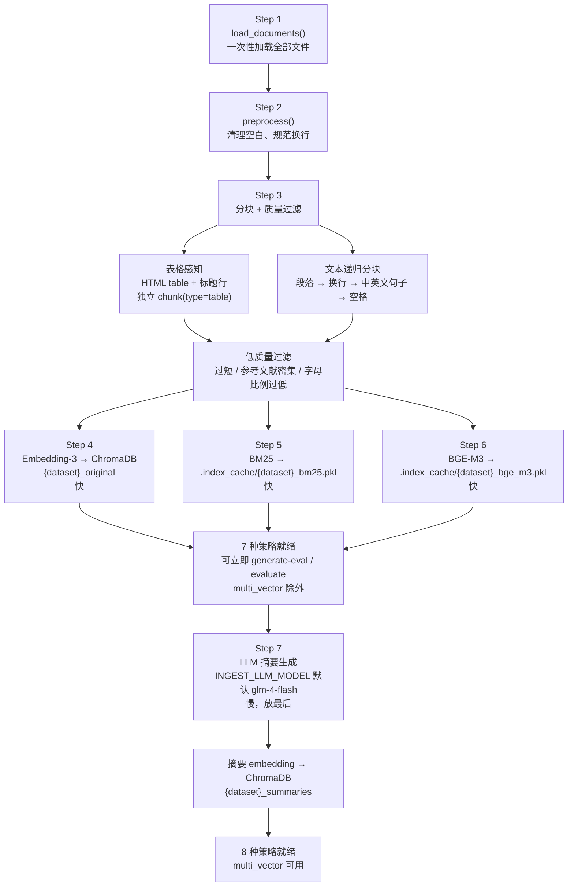

> **为什么摘要放最后？** 摘要生成是 ingest 中最慢的步骤（每 chunk 一次 LLM 调用），而 8 种检索策略中只有 `multi_vector` 依赖摘要。将摘要放到最后，Step 6 完成后即可立即运行 `generate-eval` 和 `evaluate`（7 种策略），不必等待摘要完成。

#### 增量模式

逐文件处理，每个文件独立完成 Embedding，中断后可续传：

```
python main.py ingest -d wg2 --doc-dir documents/wg2 --reset --incremental
```

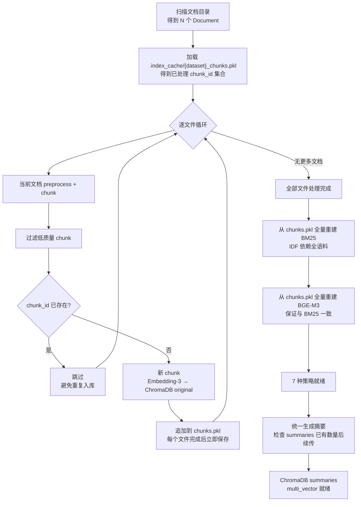

> **为什么 BM25 必须全量重建？** BM25Okapi 的 IDF（逆文档频率）需要全量语料计算——新增一个文档会改变所有词的 IDF 值，因此无法增量更新。BGE-M3 理论上可以增量 append（numpy 拼接），但为了与 BM25 保持一致，统一在最后重建。

#### 摘要中断与降级

| 场景 | 行为 |
|------|------|
| 摘要阶段 Ctrl+C | 安全中断，打印已完成数量 |
| 中断后重跑 ingest（不加 `--reset`） | 自动检测已有摘要数量，从断点续传 |
| 摘要未完成时用 `multi_vector` | 自动降级为纯原文路径检索（不报错） |
| 摘要未完成时用其他 7 种策略 | 完全不受影响 |
| 摘要未完成时跑 `generate-eval` | 完全不受影响（只需 chunks.pkl） |

### 增量入库与断点续传

**核心机制**：每个文件处理完后，将其 chunks 追加到 `.index_cache/{dataset}_chunks.pkl` 并立即保存。

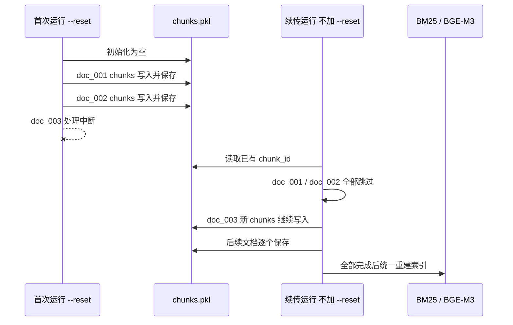

**断点续传命令**：

```bash
# 首次运行（清空重来）
python main.py ingest -d wg2 --doc-dir documents/wg2 --reset --incremental

# 中断后续传（不加 --reset！）
python main.py ingest -d wg2 --doc-dir documents/wg2 --incremental
```

### 缓存体系与数据集隔离

所有缓存文件均以 `{dataset}_` 为前缀，不同数据集完全隔离：

```
.index_cache/
├── samples_bm25.pkl                  # BM25 索引
├── samples_bge_m3.pkl                # BGE-M3 三粒度向量
├── samples_chunks.pkl                # Chunk 缓存（增量入库用）
├── samples_knowledge_graph.json      # RAGAS 知识图谱缓存（generate-eval 用）
├── wg2_bm25.pkl
├── wg2_bge_m3.pkl
├── wg2_chunks.pkl
├── wg2_knowledge_graph.json
└── ...
```

ChromaDB collections 同样按数据集隔离：

| Collection 名 | 内容 |
|---------------|------|
| `{dataset}_original` | 原文 chunk 向量 (智谱 Embedding-3, 2048d) |
| `{dataset}_summaries` | 摘要向量 (Multi-Vector 策略用) |

**`dataset delete` 的清理范围**：

```bash
python main.py dataset delete my_dataset
```

会删除：
- ChromaDB: `my_dataset_original` + `my_dataset_summaries`
- 索引缓存: `my_dataset_bm25.pkl` + `_bge_m3.pkl` + `_chunks.pkl` + `_knowledge_graph.json`
- RAGAS 缓存: `.index_cache/ragas_cache/my_dataset_*.json`

### 双索引架构

Ingest 为每个 chunk 建立**两套完全独立的索引**：

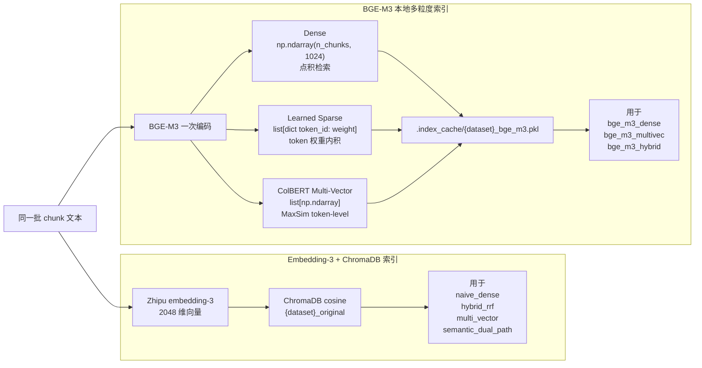

BGE-M3 **完全不使用 ChromaDB**。查询时加载 pickle 到内存，在 Python/numpy 中直接计算相似度。好处是不依赖外部服务，但整个索引需要装入内存。

### Evaluate 流程详解

```
python main.py evaluate -d wg2 --strategies naive_dense,hybrid_rrf --mode retrieval --plot
```

#### Phase 1: 逐策略 × 逐题检索

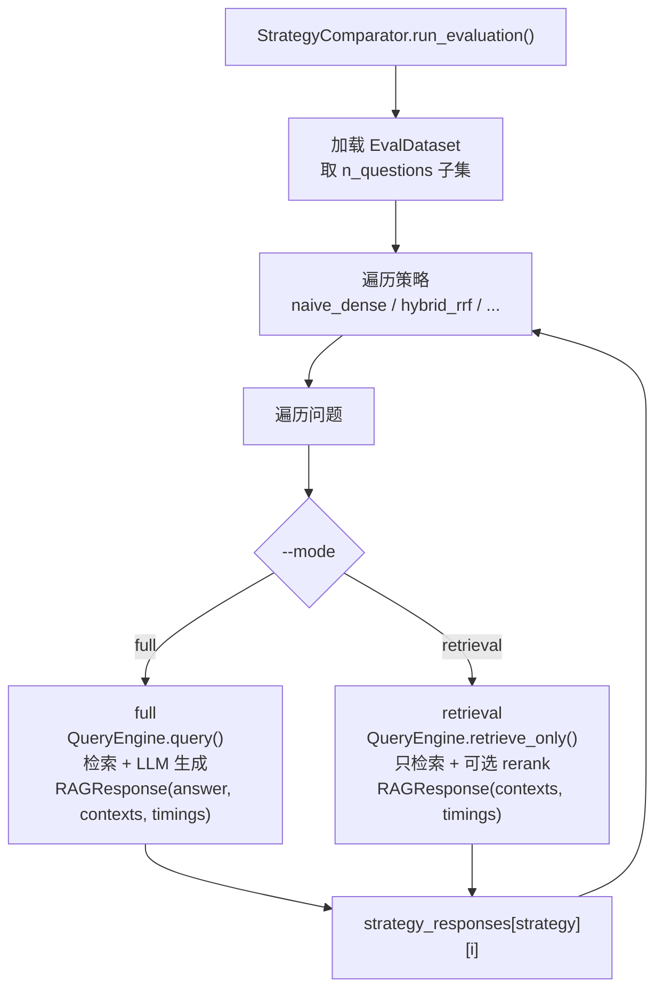

> **答案语言**：RAG 生成的答案会自动跟随问题语言（英文问题 → 英文回答）。这确保 ROUGE-L/BLEU 和 RAGAS 指标在同一语言内比较，避免跨语言评分失真。

> **智谱推理模型**：`glm-4.7-flashx`、`glm-4.7` 等默认开启思考模式的模型，在 RAGAS Judge 中会自动禁用思考（`thinking: disabled`），但作为 RAG 答案生成时保留思考能力。

#### Phase 2: 指标计算

| | retrieval mode | full mode |
|---|---|---|
| **传统检索指标** | Hit Rate, MRR, P@K, R@K, NDCG@K | — |
| **RAGAS 检索指标** | Context Precision, Context Recall | ✓ (含在 5 指标中) |
| **RAGAS 生成指标** | — | Faithfulness, Answer Relevancy, Answer Correctness |
| **文本匹配指标** | — | ROUGE-L, BLEU |
| **RAGAS 实现** | 官方 `ragas.evaluate()` | 官方 `ragas.evaluate()` |
| **Judge 模型** | 由 `RAGAS_JUDGE_PROVIDER` 决定（推荐 OpenAI） | 同左 |
| **Judge 并发** | `RunConfig(max_workers=MAX_CONCURRENT_JUDGE)` | 同左 |
| **Phase 1 问答** | — | 串行（智谱 ZhipuAI client 线程安全限制） |

#### Phase 3: 可视化

| retrieval mode (5 张) | full mode (6 张) |
|---|---|
| 01_retrieval_metrics.png (检索指标柱状图) | 01_ragas_radar.png (5 维雷达图) |
| 02_retrieval_latency.png (检索延迟) | 02_quality_metrics.png (质量指标) |
| 03_context_heatmap.png (Context 热力图) | 03_latency.png (延迟堆叠) |
| 04_difficulty_breakdown.png (按难度分组) | 04_faithfulness_heatmap.png (Faithfulness 热力图) |
| 05_strategy_ranking.png (综合排名) | 05_difficulty_breakdown.png (按难度分组) |
| | 06_strategy_ranking.png (综合排名) |

> **推荐流程**：先用 `--mode retrieval` 秒级对比所有策略的检索质量，筛选 top 2-3 策略后再跑 `--mode full` 评估端到端生成质量。

#### 缓存与续传

evaluate 的完整流程分为两个阶段，每个阶段有独立的缓存：

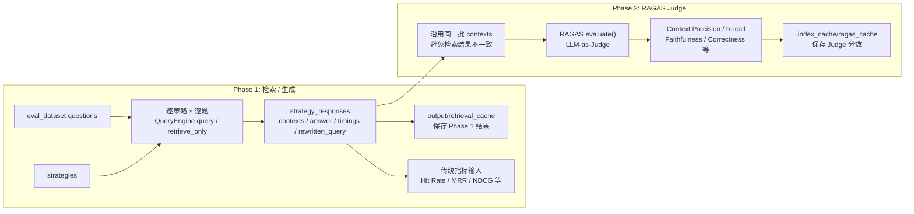

**关键设计**：Phase 2 的输入（contexts）来自 Phase 1 的 `strategy_responses` 字典。两个阶段在同一次运行中共享**完全相同的检索结果**，不存在不一致的问题。

##### Retrieval Cache（Phase 1 缓存）

**缓存什么**：每个策略对每个问题的检索结果（返回了哪些 contexts、HyDE 生成的假设文档等）

**为什么需要**：
1. **续传**：中断后重跑，已完成的策略秒级跳过
2. **HyDE 一致性**：`semantic_dual_path` 每次运行会生成不同的 HyDE 文本（LLM 随机性），缓存冻结首次运行的结果，确保后续重跑基于相同的 contexts

```
output/retrieval_cache/
├── wg2_naive_dense_retrieval_n30.json              # retrieval 模式（不含模型名）
├── wg2_semantic_dual_path_retrieval_n30.json       # 含 HyDE 文本，冻结 LLM 输出
├── wg2_naive_dense_full_n10_glm-4.7.json           # full 模式（含 LLM 模型名）
└── wg2_bge_m3_hybrid_full_n10_deepseek-chat.json   # 换模型 → 不同缓存文件
```

命名规则：
- **retrieval 模式**：`{dataset}_{strategy}_retrieval_n{题数}.json`（不含模型名，检索结果确定性）
- **full 模式**：`{dataset}_{strategy}_full_n{题数}_{llm_model}.json`（含 LLM 模型名，因为不同模型的 answer 不同）

##### RAGAS Cache（Phase 2 缓存）

**缓存什么**：RAGAS Judge 对每个策略的评分结果（Context Precision、Context Recall 等）

**为什么需要**：
1. **续传**：RAGAS 是最耗时的阶段（每策略 10+ 分钟），中断后不用重跑
2. **跨次复用**：改变策略组合时，之前已评估过的策略直接复用

```
.index_cache/ragas_cache/
├── wg2_naive_dense_retrieval_n30_deepseek-chat.json     # 包含 Judge 模型名
├── wg2_bge_m3_hybrid_retrieval_n30_deepseek-chat.json
└── wg2_multi_vector_full_n30_glm-4.json                 # 换模型 → 不同文件
```

命名：`{dataset}_{strategy}_{mode}_n{题数}_{judge_model}.json`（含模型名：换 Judge 模型自动失效）

##### 两级缓存的协作

| 场景 | Retrieval Cache | RAGAS Cache | 效果 |
|------|----------------|-------------|------|
| 首次运行 | miss → 执行检索 → 保存 | miss → 调用 Judge → 保存 | 全量运行 |
| 中断续传 | hit → 跳过 | 部分 hit → 从断点继续 | 秒级恢复已完成策略 |
| 换 Judge 模型 | hit → 跳过（检索不变） | miss → 重新评估 | 只重跑 RAGAS |
| `--no-cache` | 忽略 → 全部重跑 | 忽略 → 全部重跑 | 强制全量重新评估 |
| `dataset delete` | 清除 | 清除 | 完全重置 |

##### 使用方式

```bash
# 默认使用缓存（中断后重跑，已完成的策略秒级跳过）
python main.py evaluate -d wg2 --mode retrieval --n-questions 30 \
  --strategies naive_dense,hybrid_rrf,bge_m3_hybrid

# 强制忽略缓存，全部重新评估
python main.py evaluate -d wg2 --mode retrieval --n-questions 30 --no-cache

# 清除数据集的所有缓存（含检索和 RAGAS）
python main.py dataset delete wg2
```

##### 续传场景示例

```
首次运行（5 个策略，中断在第 3 个的 RAGAS 阶段）：
  Strategy 1: naive_dense          → Phase1 ✓ → Phase2 ✓ → 两级缓存已保存
  Strategy 2: hybrid_rrf           → Phase1 ✓ → Phase2 ✓ → 两级缓存已保存
  Strategy 3: bge_m3_hybrid        → Phase1 ✓ → Phase2 💥 中断（检索缓存已保存，RAGAS 未保存）
  Strategy 4: multi_vector         → 未开始
  Strategy 5: semantic_dual_path   → 未开始

重跑同一命令：
  Strategy 1: naive_dense          → Phase1 缓存 ✓ → Phase2 缓存 ✓     (0s)
  Strategy 2: hybrid_rrf           → Phase1 缓存 ✓ → Phase2 缓存 ✓     (0s)
  Strategy 3: bge_m3_hybrid        → Phase1 缓存 ✓ → Phase2 重跑 RAGAS  (从这里续传)
  Strategy 4: multi_vector         → Phase1 重跑   → Phase2 重跑 RAGAS
  Strategy 5: semantic_dual_path   → Phase1 重跑   → Phase2 重跑 RAGAS
```

#### 结果保存

所有评估结果保存到 `output/history/eval_{dataset}_{timestamp}/`：

```
output/history/eval_wg2_20260401_143000/
├── full_results.json    # 完整 JSON（meta + summary + details 逐题明细）
├── details.csv          # 扁平化 CSV（方便 pandas 分析）
├── comparison_table.txt # 对齐的纯文本对比表格
├── checkpoint.json      # 中间检查点
└── *.png                # 可视化图表
```

### Generate-eval 流程详解

```
python main.py generate-eval -d wg2 --domain ipcc --n-questions 50 --model deepseek-chat
```

基于 [RAGAS TestsetGenerator](https://docs.ragas.io/en/stable/concepts/test_data_generation/) 实现，通过**领域配置系统**注入专用的 persona、prompt 引导和质量过滤。

#### 整体流程

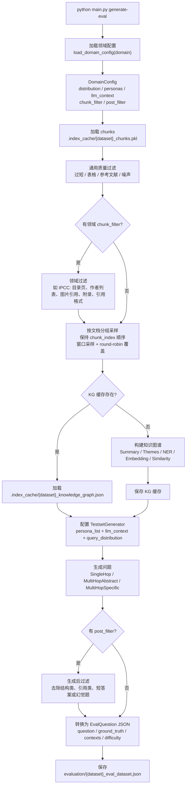

如果目标文件已存在，生成器会先自动备份旧文件（加时间戳后缀），再写入新的 `evaluation/{dataset}_eval_dataset.json`。

#### 领域配置系统

```
evaluation/domains/
├── __init__.py    # DomainConfig 定义 + load_domain_config() 加载器
├── default.py     # 通用默认（无 persona/过滤/引导）
└── ipcc.py        # IPCC 气候报告专用
```

**DomainConfig 数据流**：

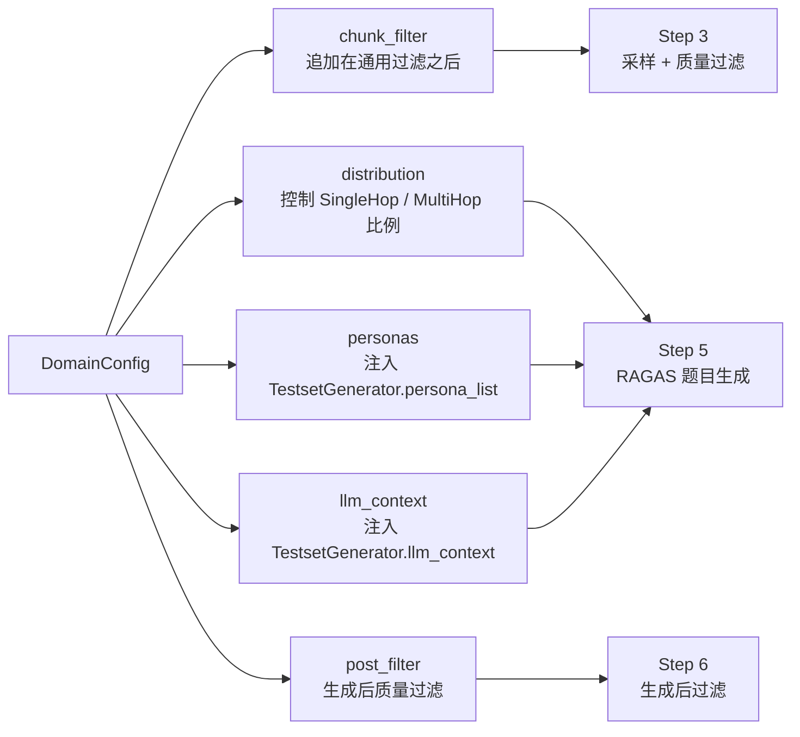

**新增领域的步骤**：

1. 创建 `evaluation/domains/medical.py`
2. 定义 `DOMAIN_CONFIG = DomainConfig(name="medical", ...)`
3. 使用: `python main.py generate-eval -d my_data --domain medical`

领域配置是纯 Python 文件，可以定义任意复杂的过滤函数。核心代码 `generate.py` 完全领域无关。

#### IPCC 领域配置详解

| 组件 | 默认 | IPCC |
|------|------|------|
| **distribution** | 40/30/30 | 20/40/40（更多推理和跨文档题） |
| **personas** | 自动生成 | 3 个专业角色 |
| **llm_context** | 无 | 引导定量/对比/因果/不确定性/跨部门题型 |
| **chunk_filter** | 通用规则 | +目录页/作者列表/图片引用/附录/引用格式 |
| **post_filter** | 无 | 过滤作者/引用/结构类 + 短答案 + 幻觉检测 |
| **过量生成** | 无 | +30% 补偿 post_filter 损耗 |

IPCC 的 3 个 Persona：

| Persona | 关注点 | 生成的题目特征 |
|---------|--------|--------------|
| Climate Policy Analyst | 数字、置信度、温度阈值、时间节点 | 定量比较、与 AR5 的变化 |
| Climate Adaptation Engineer | 地区风险、适应措施、跨部门 | 复合场景（水-粮食-健康-能源） |
| Climate Vulnerability Researcher | 不平等、边缘化群体、公平性 | 分配影响、公正维度 |

#### 知识图谱缓存

知识图谱构建占整个生成流程 90% 的时间。首次构建后自动缓存到 `.index_cache/{dataset}_knowledge_graph.json`，后续运行直接加载：

| 场景 | 耗时（300 chunks, 50 题） |
|------|--------------------------|
| 首次运行（构建 KG + 生成题目） | ~15 分钟 |
| 再次运行（加载 KG + 生成题目） | ~2 分钟 |
| 网络中断后重跑 | ~2 分钟（KG 已缓存） |

**缓存失效时机**：当 ingest 重新入库（`--reset`）后，chunk 内容可能变化，旧 KG 不再匹配。此时需删除 KG 缓存重新构建：

```bash
# 删除 KG 缓存，下次 generate-eval 会重新构建
rm .index_cache/wg2_knowledge_graph.json

# 或者删除整个数据集的所有缓存
python main.py dataset delete wg2
```

**旧评估文件保护**：每次生成新的评估数据集时，如果同名文件已存在，会自动备份为 `{dataset}_eval_dataset_{timestamp}.json`，不会覆盖。

#### 并发控制

项目按阶段独立控制并发，因为不同阶段使用不同模型，QPS 限制差异很大：

| 阶段 | 使用的模型 | 并发变量 | 推荐值 |
|------|-----------|---------|--------|
| `generate-eval` KG 构建 | `GENERATE_EVAL_LLM_MODEL`（智谱） | `MAX_CONCURRENT_GENERATE` | 5-10 |
| `evaluate` RAGAS Judge | `RAGAS_JUDGE_MODEL`（OpenAI） | `MAX_CONCURRENT_JUDGE` | 20-50 |
| `evaluate` Phase 1 问答 | `LLM_MODEL`（智谱） | 串行（不并发） | — |
| `ingest` 摘要生成 | `INGEST_LLM_MODEL`（智谱） | 串行（不并发） | — |

**1. generate-eval（KG 构建）** — 受 `MAX_CONCURRENT_GENERATE` 控制

```
300 chunks × 3 extractors = 900 次 LLM 调用
        │
        ├─ MAX_CONCURRENT_GENERATE=1   → ~60 min
        ├─ MAX_CONCURRENT_GENERATE=5   → ~12 min
        └─ MAX_CONCURRENT_GENERATE=10  → ~6 min
```

**2. evaluate（RAGAS Judge）** — 受 `MAX_CONCURRENT_JUDGE` 控制

```
30 题 × 4 策略 = 120 组 × 每组 2 指标 (retrieval) 或 5 指标 (full)
        │
        ├─ MAX_CONCURRENT_JUDGE=5   → retrieval: ~6 min
        ├─ MAX_CONCURRENT_JUDGE=20  → retrieval: ~2 min（OpenAI 推荐）
        └─ MAX_CONCURRENT_JUDGE=50  → retrieval: ~1 min
```

**3. evaluate Phase 1 问答 / ingest 摘要** — 串行执行

智谱 `ZhipuAI` client 存在线程安全限制，多线程调用会卡死。因此问答生成和摘要生成保持串行，通过内置的 429 指数退避重试保证稳定性。

**安全机制**：`generate-eval` 的 `--max-workers` 会被自动 cap 到 `MAX_CONCURRENT_GENERATE`。未设分阶段变量时，fallback 到 `MAX_CONCURRENT`。

```bash
# .env 示例（智谱低并发，OpenAI 高并发）
MAX_CONCURRENT_GENERATE=5     # 智谱 glm-4-flash
MAX_CONCURRENT_JUDGE=20       # OpenAI gpt-4.1-mini

# generate-eval 的 --max-workers 受 cap
python main.py generate-eval -d wg2 --max-workers 50
# → 实际 Workers: 5 (limit: MAX_CONCURRENT_GENERATE=5)
```

#### RAGAS 与 LLM Provider 的集成

RAGAS 通过 OpenAI-compatible 接口调用 LLM，支持三种 provider：

```python
# generate-eval：用智谱构建知识图谱和生成题目
client = openai.OpenAI(api_key=ZHIPUAI_API_KEY, base_url="https://open.bigmodel.cn/api/paas/v4")
llm = llm_factory(model="glm-4-flash", provider="openai", client=client)

# evaluate：用 OpenAI 做 RAGAS Judge（推荐，完整支持 n 参数）
client = openai.OpenAI(api_key=OPENAI_API_KEY)
llm = llm_factory(model="gpt-4o-mini", provider="openai", client=client, max_tokens=4096)

# Embedding（Answer Relevancy 指标需要）：用 LangChain OpenAIEmbeddings 桥接智谱
from langchain_openai import OpenAIEmbeddings
embeddings = OpenAIEmbeddings(model="embedding-3", openai_api_key=ZHIPUAI_API_KEY, ...)
```

| Provider | 优势 | 限制 |
|----------|------|------|
| **OpenAI** | 完整支持 `n` 参数，Answer Relevancy 精度最高 | 需要 OpenAI API Key |
| **DeepSeek** | 便宜、快速 | `n` 参数不支持，Answer Relevancy 降级 |
| **智谱** | 与生成模型同一平台 | 可能有同源偏差 |

### LLM 调用日志

**所有 LLM 调用**都会自动记录到 `output/logs/`，包括项目自身的 `LLM.generate()` 和 RAGAS 内部的调用（通过 OpenAI client 拦截）。按任务类型 + 数据集 + 时间戳分文件：

```
output/logs/
├── ingest_wg2_20260331_160000.jsonl        # ingest 摘要生成（LLM.generate）
├── evaluate_wg2_20260331_170000.jsonl      # evaluate RAGAS Judge（OpenAI client 拦截）
├── generate_eval_wg2_20260401_120000.jsonl  # generate-eval 知识图谱构建（OpenAI client 拦截）
├── query_wg2_20260331_180000.jsonl         # 单次查询
├── interactive_test_20260331_190000.jsonl    # 交互式查询
└── llm_calls.jsonl                           # 兜底（未设置上下文时）
```

每行一条 JSON，包含 `source` 字段标识调用来源：

```json
{
  "ts": "2026-04-02 15:48:41",
  "provider": "deepseek",
  "model": "deepseek-chat",
  "source": "ragas_evaluate",
  "prompt": "Given question, answer and context verify if the context was useful...",
  "system": "...",
  "output": "{\"reason\": \"...\", \"verdict\": 1}",
  "output_len": 232,
  "usage": {"prompt_tokens": 1188, "completion_tokens": 45, "total_tokens": 1233},
  "elapsed_s": 2.1
}
```

**日志捕获机制**：

| 命令 | 调用路径 | 捕获方式 |
|------|---------|---------|
| `ingest` / `query` / `interactive` | `LLM.generate()` | LLM 类内置日志 |
| `evaluate` (RAGAS Judge) | RAGAS `evaluate()` → OpenAI client | OpenAI client monkey-patch 拦截 |
| `generate-eval` (知识图谱) | RAGAS `TestsetGenerator` → OpenAI client | OpenAI client monkey-patch 拦截 |

```bash
# 查看某次评估的 RAGAS 调用日志
cat output/logs/evaluate_wg2_*.jsonl | python -m json.tool | head -20

# 统计总 token 用量
cat output/logs/evaluate_wg2_*.jsonl | python -c "
import json, sys
total = sum(json.loads(l).get('usage',{}).get('total_tokens',0) for l in sys.stdin)
print(f'Total tokens: {total:,}')
"
```

---

## 关键算法说明

### Reciprocal Rank Fusion (RRF)

RRF 用于融合多个检索器的排名列表，无需对分数进行归一化：

$$\mathrm{RRF\text{-}score}(d) = \sum_{r \in \mathrm{Rankers}} \frac{1}{k + \mathrm{rank}_r(d)}$$

- $k$ 是平滑参数（默认 60），防止排名靠前的文档权重过大
- 对每个文档，将其在各个检索器中的排名倒数求和
- 最终按 RRF 分数降序排列

RRF 在本项目中用于 3 个策略：Hybrid RRF、Multi-Vector、Semantic Dual-Path。

### HyDE (Hypothetical Document Embeddings)

核心思想：query 和 document 之间存在语义鸿沟（query 短而抽象，document 长而具体）。

1. 用 LLM 根据 query 生成一个"假设性回答"（不需要正确，只需要风格和用词接近真实文档）
2. 对假设性回答做 embedding
3. 用该 embedding 替代原始 query embedding 去检索

假设性回答的 embedding 通常比短 query 的 embedding 更接近目标文档的 embedding 空间。

### BGE-M3 多粒度检索

BGE-M3（智源研究院）的核心创新是 **一个模型同时输出三种表示**：

1. **Dense**: 与普通 embedding 模型相同，生成 1024 维稠密向量
2. **Learned Sparse**: 输出 token → weight 字典，权重由模型学习（而非 BM25 的统计计算），能识别同义词关联
3. **ColBERT Multi-Vector**: 为每个 token 生成独立向量，检索时用 MaxSim 操作

**ColBERT MaxSim** 的 Late Interaction 机制：

$$\text{score}(Q, D) = \sum_{i=1}^{n} \max_{j=1}^{m} \text{sim}(q_i, d_j)$$

对 query 中的每个 token embedding，找到 document 中与其最相似的 token embedding，求和。比单向量 Dense 更精细（token-level 交互），同时 document 端可离线编码。

**三路融合（hybrid）** 使用加权求和：$\text{score} = 0.4 \cdot \text{dense} + 0.2 \cdot \text{sparse} + 0.4 \cdot \text{colbert}$。权重可在 `config.py` 中调整。

### RAGAS Faithfulness 评估

Faithfulness（忠实度）衡量答案是否完全基于检索到的上下文：

1. 用 LLM 从答案中提取所有事实性声明（claims）
2. 对每个 claim，用 LLM 判断它是否能从检索上下文中推导出来
3. $\text{Faithfulness} = \frac{\text{可推导的 claims 数}}{\text{总 claims 数}}$

这是 RAG 系统最重要的指标之一 — 高 Faithfulness 意味着模型在"基于证据回答"而非"自由发挥"。
